
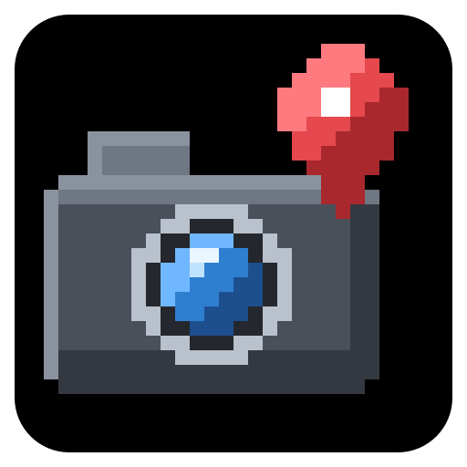

<h1 align="center">Tweakeroo Freecam Plus</h1>

Waypoints, adjustable sprint speed and a pointer back to your character for Tweakeroo's free camera.

为 Tweakeroo 的灵魂出窍加上标记点、可调的疾跑速度，以及指回本体的箭头。

<a href="#english">English</a> · <a href="#简体中文">简体中文</a>

   

# English

A small client-side add-on for the **Free Camera** of [Tweakeroo](https://modrinth.com/mod/tweakeroo). Scout a spot with the free camera, mark it with the middle mouse button, and let arrows lead you there once you are back in your body. Hold Ctrl and scroll to fly faster or slower, and tap Ctrl three times when you lose track of where you left your character.

There are no settings and no switches. Install it, and Tweakeroo's free camera has these extras.

## Features

### Waypoints

- **Set a waypoint with the middle mouse button.** While the free camera is on, press the Pick Block key (middle mouse button by default) to put a waypoint on the block under your crosshair, up to 256 blocks away. If no block is in reach, for example when you look at the sky, the waypoint goes where the camera is. The action bar confirms it with the waypoint's number and coordinates.
- **Remove it the same way.** Middle-click while looking at a waypoint, or very close to it, to remove it again.
- **Visible through walls.** Every waypoint is drawn as a pink box around its block with a beam rising 24 blocks above it. Both show through terrain, in the free camera and in your normal view.
- **Arrows lead the way.** Small arrows on a ring around your crosshair point towards each waypoint, labelled with its number and distance in blocks. A tag tells you when it is more than 3 blocks above or below you. The arrows stay after you leave the free camera, so you can walk to the spot you scouted.
- **Cleared on arrival.** A waypoint disappears by itself once your character is within 3 blocks of it.
- **Remembered per world.** Waypoints are saved for each singleplayer world and each server address, and they are back when you return. You can have up to 10 at a time per world or server; an 11th replaces the oldest. Only the waypoints of the dimension you are in are shown.

### Sprint speed

- **Ctrl + mouse wheel changes the speed.** In the free camera, hold your Sprint key (Left Ctrl by default) and scroll up or down to step through x1, x1.5, x2, x3, x4, x6, x8, x12, x16, x24, x32, x48 and x64. It starts at x3, Tweakeroo's own sprint speed.
- **The hotbar stays put.** While Sprint is held in the free camera, the wheel only changes the speed, and your selected hotbar slot does not move.
- **Back to normal on every toggle.** The speed returns to x3 whenever you switch the free camera on or off, so a new flight never starts at a speed you forgot about.
- **Sprint indicator.** While the free camera is on, a small line at the top of the screen shows whether the camera is sprinting and the current speed, for example `Sprint ON  x6` in green or `Sprint OFF  x3` in grey.

### Find your character

- **Triple-tap Ctrl.** Tap Sprint three times quickly in the free camera. For 5 seconds your character gets a cyan outline that shows through walls, and a cyan arrow on the crosshair ring points at it with the distance.

### Toggle Sprint

- **No flickering.** If you use the vanilla "Sprint: Toggle" setting, the free camera now sprints while you actually hold Ctrl, instead of switching on and off while the key is held. As in Tweakeroo, sprint then stays on until you stop moving forward or backward.
- **Your character's sprint is left alone.** With Toggle Sprint, pressing Ctrl in the free camera no longer switches your character's sprint on or off. When you leave the free camera, it is exactly as you left it.

## Screenshots

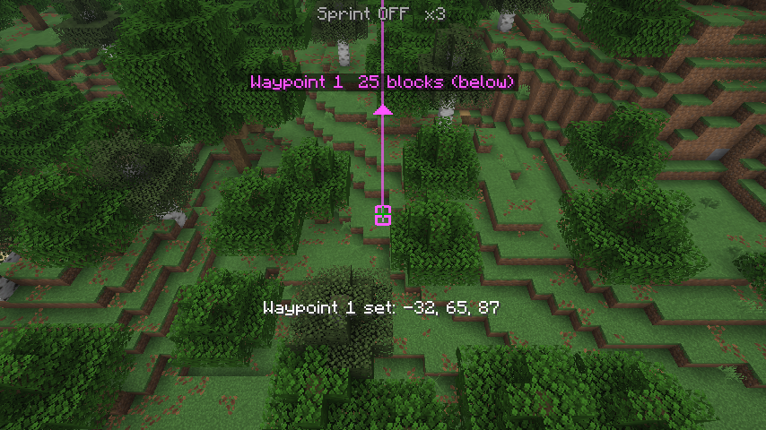

Setting a waypoint from the free camera. A pink box and beam mark the block, and the action bar shows the waypoint's number and coordinates.

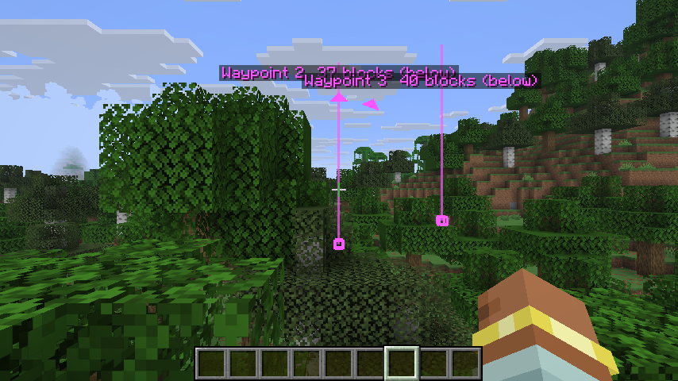

Back in your body, the beams and the arrows around the crosshair lead you to each waypoint.

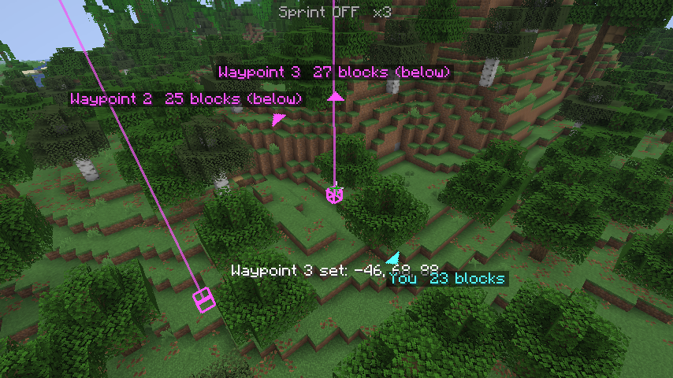

After a triple tap on Ctrl, a cyan arrow points to your own character and shows the distance.

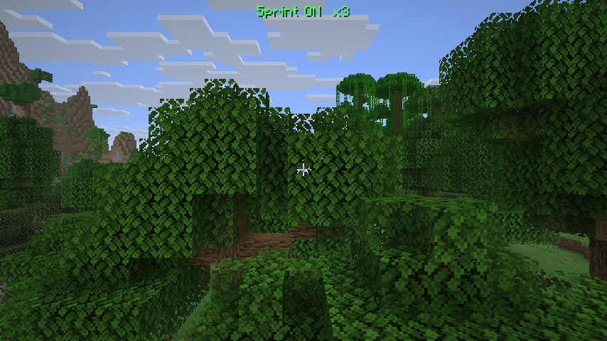

The sprint indicator at the top of the screen while flying in the free camera.

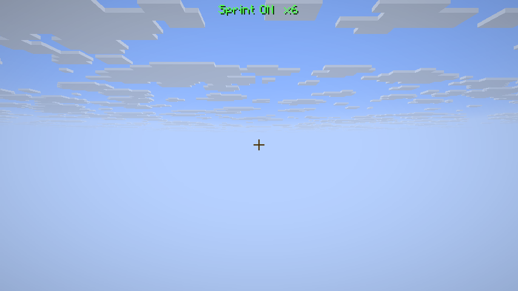

Two scrolls up with Ctrl held: the sprint speed is now x6.

## How to use

The mod adds no key bindings, commands or settings screen of its own. It uses two vanilla keys, and only while Tweakeroo's free camera is on:

| Action | Default key | Where to change it |
|---|---|---|
| Set or remove a waypoint (in the free camera) | Middle mouse button (Pick Block) | Options → Controls → Key Binds → Pick Block |
| Change the sprint speed (in the free camera) | Hold Left Ctrl (Sprint) + mouse wheel | Options → Controls → Key Binds → Sprint |
| Point at your character for 5 seconds (in the free camera) | Tap Left Ctrl (Sprint) three times quickly | Options → Controls → Key Binds → Sprint |
| Switch the free camera on or off | No key by default (Tweakeroo's Free Camera tweak) | Tweakeroo's menu (X + C) → Tweaks → Free Camera (`tweakFreeCamera`) |

Outside the free camera, Pick Block, Sprint and the mouse wheel work as usual.

### Mark a spot and walk to it

1. Switch on Tweakeroo's Free Camera.
2. Fly to the spot and look at the block you want to mark.
3. Press the middle mouse button. A pink box and beam appear, and the action bar shows the waypoint's number and coordinates.
4. Switch the free camera off and follow the arrow around your crosshair, or the beam.
5. When you are within 3 blocks, the waypoint removes itself. To remove it earlier, look at it in the free camera and middle-click again.

### Fly faster or slower

1. In the free camera, hold Ctrl.
2. Scroll up for more speed, down for less. The line at the top of the screen shows the current value.
3. Fly forward while holding Ctrl to sprint at that speed. Sprint stays on until you stop moving forward or backward.
4. Switching the free camera off and on again sets the speed back to x3.

### Find your character

In the free camera, tap Ctrl three times within about 0.7 seconds. For 5 seconds your character is outlined in cyan, and an arrow on the crosshair ring shows its direction and distance.

## Settings

There is nothing to configure: no options screen and no config file. For reference, these are the fixed values the mod uses:

| Name | Value | What it does |
|---|---|---|
| Waypoint reach | 256 blocks | How far the middle click looks for a block. |
| Waypoints per world or server | 10 | An 11th waypoint replaces the oldest one. |
| Arrival distance | 3 blocks | A waypoint is removed once your character is this close. |
| Above / below tag | more than 3 blocks | When the arrow label says the waypoint is above or below you. |
| Sprint speeds | x1 to x64 (13 steps) | The values Ctrl + mouse wheel steps through. |
| Starting speed | x3 | Tweakeroo's own sprint speed, used again after every toggle. |
| Triple tap | 3 taps within 0.7 seconds | Shows the pointer to your character. |
| Pointer time | 5 seconds | How long the pointer to your character stays visible. |

## Requirements

| Dependency | Version |
|---|---|
| Minecraft | 1.21.11 |
| Fabric Loader | 0.17.0 or newer |
| [Fabric API](https://modrinth.com/mod/fabric-api) | for 1.21.11 (built with 0.141.6) |
| [Tweakeroo](https://modrinth.com/mod/tweakeroo) | 0.27.15, exactly this version |
| [MaLiLib](https://modrinth.com/mod/malilib) | the version Tweakeroo 0.27.15 needs: 0.27.19 or newer within 0.27.x (built with 0.27.20) |
| Java | 21 |

Client-side only. The server does not need it, so it works in singleplayer and on servers.

## Compatibility

- **Tweakeroo version.** This mod changes how Tweakeroo's free camera moves, so it is tied to Tweakeroo 0.27.15. With any other Tweakeroo version, Fabric Loader stops the game at startup and tells you which version is needed.
- **Other free camera mods.** Only Tweakeroo's Free Camera gets the extras. Other free camera mods are not affected.
- **Pick Block in the free camera.** While the free camera is on, the Pick Block key sets waypoints and does not pick blocks. Outside the free camera it works as usual.
- **Ctrl + mouse wheel.** The wheel is only taken over while the free camera is on and Sprint is held. If another mod also uses Ctrl + mouse wheel, the two can get in each other's way in that moment.
- **Sprint on a mouse button.** Ctrl + wheel works with any Sprint binding, but the triple tap only works when Sprint is bound to a keyboard key.
- **Sodium, Iris and other rendering mods.** There are no compatibility notes yet. If waypoint boxes or beams do not show up, please [open an issue](https://github.com/Autyism/TweakerooFreecamPlus/issues).

## Installation

1. Install [Fabric Loader](https://fabricmc.net/use/) for Minecraft 1.21.11.
2. Download [Fabric API](https://modrinth.com/mod/fabric-api), [MaLiLib](https://modrinth.com/mod/malilib), [Tweakeroo](https://modrinth.com/mod/tweakeroo) 0.27.15 and Tweakeroo Freecam Plus.
3. Put all four `.jar` files into the `mods` folder of your Minecraft directory (or of your launcher instance).
4. Start the game with the Fabric profile and switch on Tweakeroo's Free Camera.

## FAQ

**My middle click removes a waypoint instead of setting a new one.**

A middle click removes a waypoint that is within about 6 degrees of your crosshair. To set a new waypoint close to an existing one, fly closer, so that the two are further apart on screen.

**A waypoint I just set disappeared right away.**

Waypoints within 3 blocks of your character count as reached and are removed. This also happens when you set one right next to where your character stands.

**Changing the speed does nothing.**

The speed only applies while the camera sprints, and like Tweakeroo's own sprint it speeds up forward and backward flight only. Sideways and up/down movement keep their normal speed. It also has no effect while Tweakeroo's "Free Camera Player Movement" option is on, because then your movement keys move your character instead of the camera.

**Where are the waypoints stored?**

In `config/tweakeroo_freecam_plus/worlds/` inside your Minecraft folder, one file per world or server. To clear all waypoints of a world at once, delete its file while you are not in that world.

**Can other players see my waypoints?**

No. Waypoints only exist on your own screen; this mod sends nothing to the server.

## Known limitations

- The arrows show the horizontal direction only. Height is shown by the above/below tag.
- The sprint speed is not saved. It starts at x3 every time the free camera is switched on.
- Waypoints are stored by world folder name or server address. If either one changes, the old waypoints are not found.

## Credits

- [Tweakeroo](https://github.com/maruohon/tweakeroo) and [MaLiLib](https://github.com/maruohon/malilib) by masa, with Sakura-Ryoko, provide the free camera that this add-on extends. Tweakeroo Freecam Plus is an unofficial add-on by Autyism and is not affiliated with them.

## License

Tweakeroo Freecam Plus is licensed under the GNU General Public License v3.0 (GPL-3.0-only); see [LICENSE](LICENSE).

# 简体中文

一个纯客户端的小附属模组，用来增强 [Tweakeroo](https://modrinth.com/mod/tweakeroo) 的「灵魂出窍」（Free Camera，自由视角）。先用灵魂出窍飞过去看好位置，按鼠标中键打个标记，回到本体后跟着准星周围的箭头走过去就行。按住 Ctrl 滚动滚轮可以飞得更快或更慢；忘了本体停在哪儿，就连按三下 Ctrl。

没有任何设置和开关，装上之后 Tweakeroo 的灵魂出窍就带有这些功能。

## 功能

### 标记点

- **中键打标记。** 灵魂出窍时按「选取方块」键（默认鼠标中键），会在准星对着的方块上打一个标记，最远 256 格。如果够不到任何方块（比如对着天空），标记就打在视角当前所在的位置。动作栏会显示标记的编号和坐标。
- **再按一次取消。** 对着已有的标记（或离它很近的地方）再按一次中键，就会取消这个标记。
- **穿墙可见。** 每个标记都会在方块外画一个粉色方框，并向上升起一道 24 格高的光柱。两者都能穿墙显示，灵魂出窍和正常视角下都看得到。
- **箭头指路。** 准星周围有一圈小箭头，分别指向每个标记，并标出编号和距离（格）。标记比你高或低超过 3 格时，还会注明「上方」或「下方」。退出灵魂出窍后箭头依然显示，方便你走到刚才看好的地方。
- **走到就自动清除。** 本体走到离标记 3 格以内时，这个标记会自动消失。
- **按存档保存。** 标记按单人存档和服务器地址分别保存，下次进来还在。每个存档或服务器同时最多 10 个，打第 11 个时最早的那个会被顶掉。只显示当前维度的标记。

### 疾跑速度

- **Ctrl + 滚轮调速。** 灵魂出窍时按住疾跑键（默认左 Ctrl）滚动滚轮，可以在 x1、x1.5、x2、x3、x4、x6、x8、x12、x16、x24、x32、x48、x64 之间切换。初始为 x3，也就是 Tweakeroo 原本的疾跑速度。
- **快捷栏不会跟着滚。** 灵魂出窍中按住疾跑键时，滚轮只调速度，手上选中的快捷栏格子不会变。
- **每次开关都会重置。** 每次开启或关闭灵魂出窍，速度都会回到 x3，不会带着上次忘了调回来的速度起飞。
- **疾跑指示。** 灵魂出窍时，屏幕顶部会显示一行小字，告诉你视角当前是否在疾跑以及当前倍率，例如绿色的 `Sprint ON  x6` 或灰色的 `Sprint OFF  x3`。

### 找到本体

- **连按三下 Ctrl。** 在灵魂出窍中快速连按三下疾跑键，接下来 5 秒内本体会显示一圈青色描边（可穿墙），准星周围也会出现一个青色箭头指向本体，并显示距离。

### 切换疾跑

- **不再闪烁。** 如果你在原版设置里把「疾跑」设成了「切换」，现在灵魂出窍只在你真正按住 Ctrl 时疾跑，按住期间也不会再忽开忽关。和 Tweakeroo 原本一样，疾跑开始后会一直保持，直到你停止前进或后退。
- **不影响本体的疾跑状态。** 使用「切换」模式时，在灵魂出窍里按 Ctrl 不会再切换本体的疾跑。退出灵魂出窍时，本体的疾跑状态和进入前完全一样。

## 截图

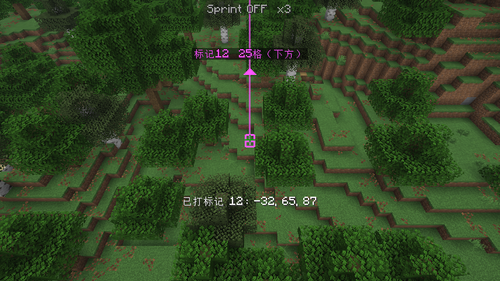

在灵魂出窍中打标记：粉色方框和光柱标出方块，动作栏显示标记编号和坐标。

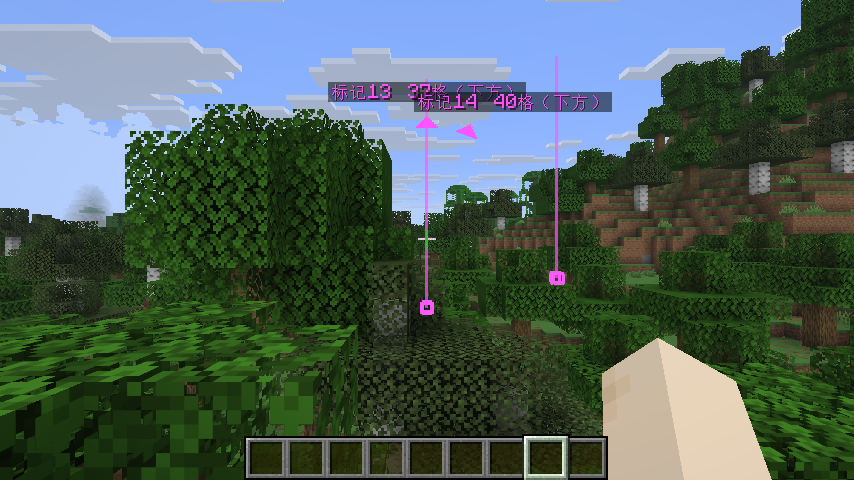

回到本体后，光柱和准星周围的箭头会带你走到每个标记。

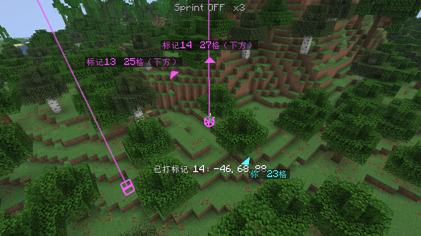

连按三下 Ctrl 后，青色箭头指向你自己的本体，并显示距离。

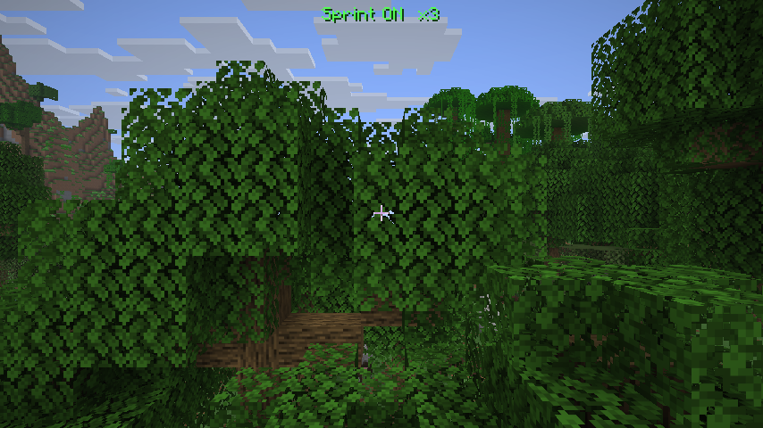

在灵魂出窍中飞行时，屏幕顶部的疾跑指示。

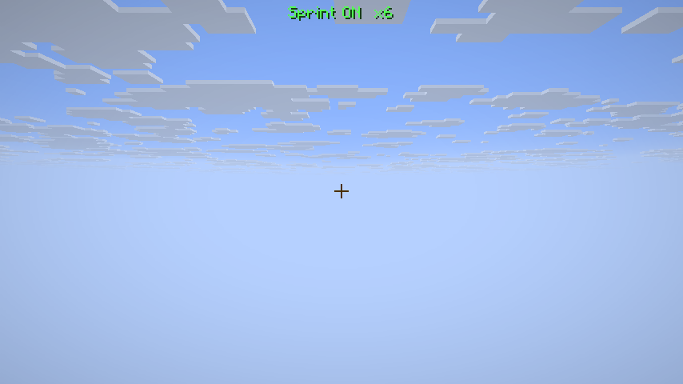

按住 Ctrl 向上滚两格后，疾跑速度变成了 x6。

## 使用方法

本模组没有自己的键位、命令或设置界面。它只借用两个原版按键，而且只在 Tweakeroo 的灵魂出窍开启时生效：

| 操作 | 默认按键 | 修改位置 |
|---|---|---|
| 打标记 / 取消标记（灵魂出窍中） | 鼠标中键（选取方块） | 选项 → 按键控制 → 按键绑定 → 选取方块 |
| 调整疾跑速度（灵魂出窍中） | 按住左 Ctrl（疾跑）+ 滚轮 | 选项 → 按键控制 → 按键绑定 → 疾跑 |
| 指向本体 5 秒（灵魂出窍中） | 快速连按三下左 Ctrl（疾跑） | 选项 → 按键控制 → 按键绑定 → 疾跑 |
| 开关灵魂出窍 | 默认无快捷键（Tweakeroo 的「灵魂出窍」功能） | Tweakeroo 配置界面（X + C）→ 功能开关 → 灵魂出窍（`tweakFreeCamera`） |

不在灵魂出窍时，选取方块、疾跑和滚轮都和平常一样。

### 标记一个位置并走过去

1. 打开 Tweakeroo 的灵魂出窍。
2. 飞到目标位置，准星对准要标记的方块。
3. 按鼠标中键。会出现粉色方框和光柱，动作栏显示标记编号和坐标。
4. 关闭灵魂出窍，跟着准星周围的箭头或光柱走过去。
5. 走到 3 格以内时标记会自动消失。想提前取消的话，在灵魂出窍中对准它再按一次中键。

### 飞快一点或慢一点

1. 在灵魂出窍中按住 Ctrl。
2. 向上滚加速，向下滚减速。屏幕顶部那行字会显示当前倍率。
3. 按住 Ctrl 向前飞，就会以这个速度疾跑。疾跑会一直保持，直到你停止前进或后退。
4. 关掉灵魂出窍再打开，速度会回到 x3。

### 找到本体

在灵魂出窍中，约 0.7 秒内连按三下 Ctrl。接下来 5 秒，本体会有一圈青色描边，准星周围的箭头会显示本体的方向和距离。

## 设置

没有任何可以设置的东西：没有设置界面，也没有配置文件。下面是本模组使用的固定数值，供参考：

| 名称 | 数值 | 说明 |
|---|---|---|
| 标记距离 | 256 格 | 中键打标记时最远能选到多远的方块。 |
| 每个存档 / 服务器的标记数 | 10 | 打第 11 个标记时会顶掉最早的那个。 |
| 到达距离 | 3 格 | 本体离标记这么近时，标记会被清除。 |
| 上方 / 下方提示 | 超过 3 格 | 高度差超过这个值时，箭头标签会注明在上方还是下方。 |
| 疾跑倍率 | x1 到 x64（共 13 档） | Ctrl + 滚轮可以切换的档位。 |
| 初始速度 | x3 | Tweakeroo 原本的疾跑速度，每次开关灵魂出窍后都会回到这里。 |
| 连按三下 | 0.7 秒内按 3 次 | 显示指向本体的箭头。 |
| 指示时长 | 5 秒 | 指向本体的箭头和描边显示多久。 |

## 前置与运行环境

| 依赖 | 版本 |
|---|---|
| Minecraft | 1.21.11 |
| Fabric Loader | 0.17.0 或更高 |
| [Fabric API](https://modrinth.com/mod/fabric-api) | 适用于 1.21.11 的版本（构建时使用 0.141.6） |
| [Tweakeroo](https://modrinth.com/mod/tweakeroo) | 0.27.15，必须是这个版本 |
| [MaLiLib](https://modrinth.com/mod/malilib) | Tweakeroo 0.27.15 所需的版本：0.27.19 及以上的 0.27.x（构建时使用 0.27.20） |
| Java | 21 |

纯客户端模组。服务器不需要安装，单人游戏和服务器里都能用。

## 兼容性

- **Tweakeroo 版本。** 本模组会改动 Tweakeroo 灵魂出窍的移动方式，所以绑定了 Tweakeroo 0.27.15。装了其他版本的 Tweakeroo 时，Fabric Loader 会在启动时报错并提示需要哪个版本。
- **其他自由视角模组。** 只有 Tweakeroo 的灵魂出窍会获得这些功能，其他自由视角模组不受影响。
- **灵魂出窍中的选取方块。** 灵魂出窍开启时，「选取方块」键用来打标记，不会再选取方块；退出灵魂出窍后恢复正常。
- **Ctrl + 滚轮。** 只有在灵魂出窍开启并且按住疾跑键时，滚轮才会被本模组接管。如果其他模组也用 Ctrl + 滚轮，这时两者可能会互相干扰。
- **疾跑绑定在鼠标键上。** Ctrl + 滚轮对任何疾跑键位都有效，但连按三下只在疾跑绑定到键盘按键时才有效。
- **Sodium、Iris 等渲染模组。** 目前还没有兼容性说明。如果标记的方框或光柱显示不出来，欢迎[提交 issue](https://github.com/Autyism/TweakerooFreecamPlus/issues)。

## 安装

1. 为 Minecraft 1.21.11 安装 [Fabric Loader](https://fabricmc.net/use/)。
2. 下载 [Fabric API](https://modrinth.com/mod/fabric-api)、[MaLiLib](https://modrinth.com/mod/malilib)、[Tweakeroo](https://modrinth.com/mod/tweakeroo) 0.27.15 和 Tweakeroo Freecam Plus。
3. 把这四个 `.jar` 文件放进游戏目录（或启动器版本隔离目录）下的 `mods` 文件夹。
4. 用 Fabric 启动游戏，打开 Tweakeroo 的灵魂出窍即可使用。

## 常见问题

**按中键时取消了旧标记，而不是打新标记。**

准星附近大约 6 度范围内有标记时，中键会取消那个标记。想在已有标记旁边再打一个，可以飞近一些，让两者在屏幕上离得远一点。

**刚打的标记马上就消失了。**

离本体 3 格以内的标记会被当作「已到达」而清除。如果你把标记打在本体站的位置旁边，也会这样。

**调了速度却没有变化。**

速度只在视角疾跑时生效，而且和 Tweakeroo 原本的疾跑一样，只加快前进和后退，左右平移和上下移动保持原速。另外，开启 Tweakeroo 的「灵魂出窍 - 本体移动」（Free Camera Player Movement）选项时也没有效果，因为这时移动键控制的是本体而不是视角。

**标记保存在哪里？**

在游戏目录的 `config/tweakeroo_freecam_plus/worlds/` 里，每个存档或服务器一个文件。想一次清空某个存档的全部标记，在不处于该存档时删掉对应的文件即可。

**其他玩家能看到我的标记吗？**

看不到。标记只显示在你自己的屏幕上，本模组不会向服务器发送任何东西。

## 已知限制

- 箭头只表示水平方向，高度由「上方 / 下方」提示表示。
- 疾跑速度不会保存，每次开启灵魂出窍都从 x3 开始。
- 标记按存档文件夹名或服务器地址保存。改了文件夹名或服务器地址后，旧的标记就找不到了。

## 鸣谢

- [Tweakeroo](https://github.com/maruohon/tweakeroo) 和 [MaLiLib](https://github.com/maruohon/malilib) 由 masa 开发（Sakura-Ryoko 参与贡献），本模组正是在 Tweakeroo 的灵魂出窍基础上扩展的。Tweakeroo Freecam Plus 是 Autyism 制作的非官方附属模组，与他们没有关联。

## 许可证

Tweakeroo Freecam Plus 采用 GNU 通用公共许可证 v3.0（GPL-3.0-only）授权，详见 [LICENSE](LICENSE)。
